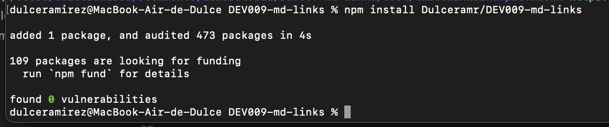
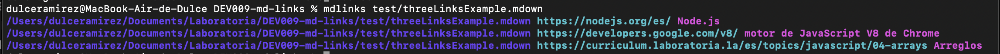

# MD-Links: A Markdown Link Checker

## Introduction

**Markdown** is a versatile lightweight markup language that's gained immense popularity among developers and content creators. Its simplicity allows users to write content using plain text formatting, which then can be seamlessly converted into HTML for web display. Platforms that handle plain text—like GitHub, various forums, and numerous blogs—often employ Markdown, making `.md` files omnipresent. One of the hallmarks of these files is the inclusion of links, which serve as a bridge to other valuable resources. However, as time progresses, these links can become outdated or broken, potentially hindering the user experience and the value of the content.

Recognizing this challenge, we introduce **md-links**. It's not just another library; it's a robust solution created with Node.js and implemented in JavaScript. Our primary mission is to assist users in verifying and reporting the status of links embedded within their Markdown files. Whether you are a content creator, a developer, or simply someone who relies heavily on Markdown files, **md-links** ensures that the quality and reliability of your links remain intact.

To guide our development process, we relied on meticulous planning, prioritizing tasks, and continuously monitoring our progress. We harnessed the power of GitHub Projects by utilizing its features like issues and milestones. Furthermore, to visualize and streamline our development approach, we implemented a flow diagram. This visual aid decomposes the process, providing a clear roadmap of how our library functions.

|  |
|:--:|
|*Flow diagram illustrating the logic of the implemented library.*|

## 2. Features
* Supports various Markdown extensions: `.md`, `.mkd`, `.mdwn`, `.mdown`, `.mdtxt`, `.mdtext`, `.markdown`, and `.text`.
* Validates the status of each link found.
* Capable of scanning entire directories.
* Comes with a built-in Command Line Interface (CLI).

## 3. Installation 

To install **MD-Links**, simply run the following command:

## Installation

To install **MD-Links**, simply run the following command:

```bash
npm install Dulceramr/DEV009-md-links
```


## Using md-links 

### As a Library

To use md-links as a library: 


```javascript
const mdLinks = require('md-links');

mdLinks('<path>', { validate: true })
    .then(links => console.log(links))
    .catch(error => console.error(error));
```

### From the Command Line

To use md-links in the command line: 
Run the "mdlinks" command followed by the file or directory file.

```bash
mdlinks <path_to_file_or_directory>
```

### Available Options

* `--validate`: Check if the link is active.
* `--stats`: Displays statistics about the links.

### API
```bash
mdlinks(<path>, <--validate>, <--stats>)
```
Analyzes and fetches links from a given file or directory.
* `path`: The file or directory's path.
* `validate`: Boolean to decide link validation.
* `stats`: Boolean to get statistics about the links.

## 4. Examples of using

### Installation
In the console within the directory you are going to install the md-links tool, just need to run the next command line:

```bash
npm install Dulceramr/DEV009-md-links
```

|  |
|:--:|
|*Installation example. Example of the simple installation running the specified command .*|

### Default use
Once the md-links are installed you can use it with the command:

```bash
mdlinks <path>
```

Path: Absolute or relative path to the file, if the path entered is relative, it must be resolved as relative to the directory from where the md-links tool was installed. 

|  |
|:--:|
|*Example of use. Example of the use of the tool md-links running the specified command followed by the absolute or relative path.*|

Running the command this way, the tool returns for each of the links the path of the file where the link was found (file), the path of the link found (href) and the text inside the link (text).

### Options: validate
Optionally you can add two parameters to the md-links function. The first option is --validate, when this option is passed an http request is made to find out if the link works, if so, "ok" is returned, otherwise it will be "fail", and the response of the status of the HTTP the request received is also obtained.

|  |
|:--:|
|**Example of use with --validate.** *Example of the use of the tool md-links running the specified command followed by the path and the flag --validate.*|

### Options: stats
The other option is --stats, the output will be basic stats about the links (total and unique).

|  |
|:--:|
|**Example of use with --stats.** *Example of the use of the tool md-links running the specified command followed by the path and the flag --stats.*|

We can also combine --validate and --stats to obtain stats that need the results of the validation.

|  |
|:--:|
|**Example of use with --validate and --stats.** *Example of the use of the tool md-links running the specified command followed by the path and the flag --validate and --stats.*|

## Acknowledgments

As the journey of creating **md-links** comes to its current stage, I'd like to take a moment to express my gratitude. First and foremost, I thank the open-source community for their continuous inspiration and the vast array of resources they offer. My peers and mentors in Laboratoria have been invaluable with their feedback and encouragement. Each query, bug report, and suggestion from my bootcamp peers and the users has been an opportunity for learning and improvement. Last but not least, my heartfelt thanks to anyone who chooses to use **md-links** and finds value in it. Your trust drives me to keep pushing the boundaries. Let's continue to build and innovate together. 

With appreciation,  
Dulce Ramirez

